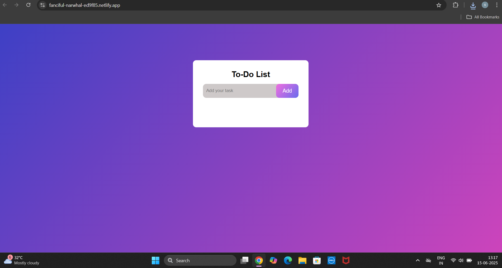
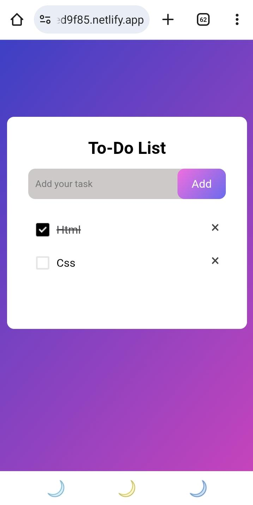

# 📝 To-Do List App

A simple and interactive To-Do List web application built using **HTML**, **CSS**, and **JavaScript**. 
Users can add, check off, and delete tasks. 
The app also saves tasks in **localStorage** so they persist after a page refresh.

---

## 🔗 Live Demo

🌐 [Click here to view the live app](https://todo-app-71.netlify.app/)

---

## ✨Features

- ✅ Add new tasks
- ☑️ Mark tasks as completed
- ❌ Delete tasks
- 💾 Tasks saved in localStorage
- 🧠 Simple logic using DOM manipulation
- 💻 Responsive design

---

## 💡 How It Works

- When a user adds a task, a new `<li>` is created and displayed in the list.
- Each task includes a "×" delete button.
- Clicking a task toggles a `checked` class (for strikethrough).
- All task data is stored in `localStorage`, so it persists even after a refresh.
- Tasks are restored from storage on page load.

---

## 🧪 Technologies Used

- HTML5
- CSS3
- JavaScript (Vanilla)
- Browser LocalStorage

---

## 📸ScreenShots 
### 💻 Desktop View

### 📱 Mobile View

